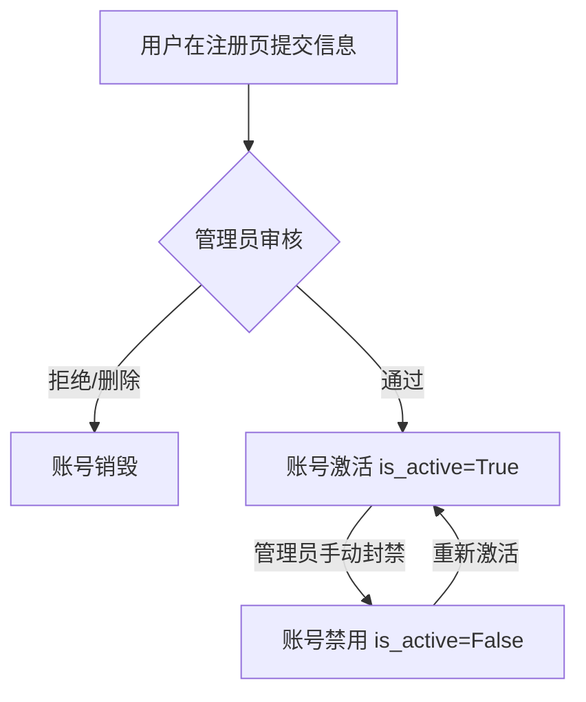

# 用户管理与注册审批系统设计规格书 (Spec)

## 1. 背景与目标
目前系统仅提供基础的登录功能，缺乏用户自主注册以及管理员对用户的生命周期管理（审批、禁用、重置密码等）。本设计旨在引入一套基于管理员审批（Admin-Audit）的注册机制，并完善基于角色的访问控制（RBAC）。

## 2. 核心架构设计

### 2.1 用户生命周期

### 2.2 角色权限定义
| 功能模块 | 操作员 (Operator) | 管理员 (Admin) |
| :--- | :---: | :---: |
| 通信机/检查项/任务管理 | √ | √ |
| 查看用户列表 | x | √ |
| 审核/激活新用户 | x | √ |
| 重置其他用户密码 | x | √ |
| 删除用户 | x | √ |
| 个人中心 (修改个人密码) | √ | √ |

## 3. 前端设计规格

### 3.1 登录与注册页面 (login.html)
- **注册入口**：在登录按钮下方增加“立即注册”链接。
- **动态表单**：点击注册后，UI 平滑切换至注册模式（不刷新页面）。
- **注册字段**：用户名 (username)、密码 (password)、确认密码 (confirm_password)。
- **反馈逻辑**：注册成功后显示“请等待管理员审核”的提示，并自动切回登录状态。

### 3.2 仪表盘用户管理页签 (dashboard.html)
- **动态导航**：前端 `shared.js` 根据用户 Token 中的 `role` 字段动态渲染导航栏，仅管理员可见“用户管理”页签。
- **列表展示**：表格展示用户名、角色、状态、创建时间。
- **交互动作**：
    - **激活/禁用**：一键切换 `is_active` 状态。
    - **重置密码**：弹窗输入新密码，调用后端重置接口。
    - **角色切换**：下拉框选择权限级别。
    - **删除**：二次确认后物理删除。

## 4. 后端接口设计规格 (api/v1/users.py)

### 4.1 注册逻辑变更 `POST /register`
- **默认属性**：强制设置 `is_active=False` 和 `role="operator"`。
- **字段过滤**：忽略请求体中任何试图修改 `is_active` 或 `role` 的参数。

### 4.2 鉴权与中间件
- **激活校验**：在所有 API 调用（包括登录）时，检查 `User.is_active` 是否为 True。若为 False，返回 403 Forbidden 并明确提示“账号待激活”。
- **角色守卫 (Role Guard)**：
    - 核心受保护接口：`GET /users`, `PATCH /users/{id}`, `DELETE /users/{id}`。
    - 实现方式：FastAPI 依赖项，通过 `current_user.role == "admin"` 进行拦截。

### 4.3 新增管理接口
- `PATCH /api/v1/users/{id}/status`: 更新激活状态。
- `PUT /api/v1/users/{id}/role`: 更新用户角色。
- `POST /api/v1/users/{id}/reset-password`: 强制重置密码。

## 5. 数据库模型说明
- 维持现有 `users` 表结构：`id`, `username`, `password_hash`, `is_active`, `role`, `created_at`。

## 6. 安全考量
- **输入校验**：严格校验用户名长度与字符规范，防止注入。
- **最小特权原则**：操作员无法通过任何前端或脚本手段请求到用户列表 API。
